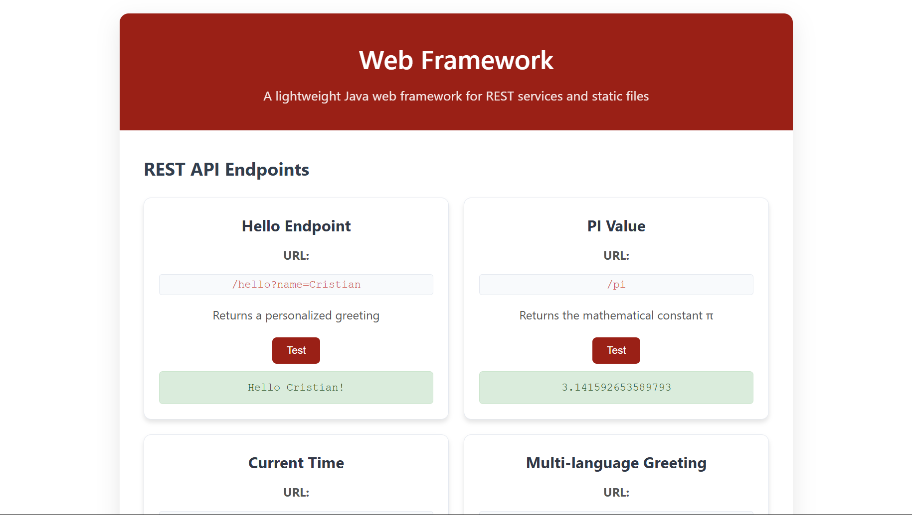

# 🚀 Java Web Framework AREP

A lightweight and powerful Java web framework that supports REST APIs and static file serving, built from scratch with modern Java features and functional programming principles.


## 🌟 Features

- **RESTful API Support**: Easy route registration with lambda expressions
- **Static File Serving**: Automatic serving of HTML, CSS, JavaScript, and images
- **Functional Programming**: Lambda-based route handlers for clean, readable code
- **Built-in HTTP Server**: No external server dependencies required
- **Query Parameter Support**: Automatic parsing and extraction of query parameters
- **MIME Type Detection**: Automatic content-type detection for various file formats
- **Lightweight**: Minimal dependencies, fast startup time
- **Thread-Safe**: Concurrent request handling with proper thread management

## 🏗️ Architecture

The framework follows a modular design with clear separation of concerns:

```
┌─────────────────┐    ┌──────────────┐    ┌─────────────────┐
│   WebFramework  │───▶│ HttpHandler  │───▶│     Router      │
│   (Main API)    │    │ (Processing) │    │ (Route Match)   │
└─────────────────┘    └──────────────┘    └─────────────────┘
                              │
                              ▼
                    ┌──────────────────┐    ┌─────────────────┐
                    │ StaticFileHandler│───▶│   MimeTypes     │
                    │ (Static Content) │    │ (Content-Type)  │
                    └──────────────────┘    └─────────────────┘
```

## 🚀 Quick Start

### Prerequisites

Before running the project, make sure you have:

- **Java 21+** - [Download here](https://www.oracle.com/java/technologies/javase-downloads.html)
- **Maven 3.8+** - [Download here](https://maven.apache.org/)

Verify your installation:

```bash
java -version
mvn -version
```

### Installation & Running

1. **Clone the repository**:
   ```bash
   git clone https://github.com/Cristian5124/Web-Framework.git
   cd Web-Framework
   ```

2. **Build the project**:
   ```bash
   mvn clean compile package
   ```

3. **Run the server**:
   ```bash
   java -cp target/Web-Framework-1.0.0.jar edu.escuelaing.app.WebFramework
   ```
   
   Or using Maven:
   ```bash
   mvn exec:java -Dexec.mainClass="edu.escuelaing.app.WebFramework"
   ```

4. **Open your browser** and navigate to:
   ```
   http://localhost:8080
   ```

   

## 💻 Usage Examples

### Basic Route Registration

```java
public class MyWebApp {
    public static void main(String[] args) throws Exception {
        // Configure static files directory
        WebFramework.staticfiles("/webroot");
        
        // Simple GET route
        WebFramework.get("/hello", (req, resp) -> "Hello World!");
        
        // Route with query parameters
        WebFramework.get("/greet", (req, resp) -> {
            String name = req.getValues("name");
            return "Hello " + (name.isEmpty() ? "Anonymous" : name) + "!";
        });
        
        // JSON response
        WebFramework.get("/api/time", (req, resp) -> {
            resp.type("application/json");
            return "{\"time\":\"" + java.time.LocalDateTime.now() + "\"}";
        });
        
        // Start the server (runs on port 8080)
        System.out.println("Server running on http://localhost:8080");
    }
}
```

### Advanced Usage

```java
// Calculator API
WebFramework.get("/calc", (req, resp) -> {
    try {
        double a = Double.parseDouble(req.getValues("a"));
        double b = Double.parseDouble(req.getValues("b"));
        String op = req.getValues("op");
        
        double result = switch(op) {
            case "add" -> a + b;
            case "sub" -> a - b;
            case "mul" -> a * b;
            case "div" -> a / b;
            default -> throw new IllegalArgumentException("Invalid operation");
        };
        
        resp.type("application/json");
        return "{\"result\":" + result + "}";
    } catch (Exception e) {
        resp.status(400);
        return "{\"error\":\"" + e.getMessage() + "\"}";
    }
});
```

## 🌐 API Endpoints

The framework comes with several pre-configured endpoints for demonstration:

| Method | Endpoint | Description | Example |
|--------|----------|-------------|---------|
| GET | `/` | Serves the main interface | `http://localhost:8080/` |
| GET | `/hello` | Simple greeting | `http://localhost:8080/hello` |
| GET | `/hello?name=John` | Personalized greeting | `http://localhost:8080/hello?name=John` |
| GET | `/pi` | Mathematical constant π | `http://localhost:8080/pi` |
| GET | `/time` | Current server time (JSON) | `http://localhost:8080/time` |
| GET | `/greet?name=Maria` | Multi-parameter greeting | `http://localhost:8080/greet?name=Maria` |
| GET | `/calc?a=5&b=3` | Basic calculator | `http://localhost:8080/calc?a=5&b=3` |

## 🧪 Testing

### Running Unit Tests

Execute the test suite:

```bash
mvn test
```


View test reports:
```bash
# Reports are generated in target/surefire-reports/
open target/surefire-reports/index.html
```

### Manual Testing with Browser

1. Start the server
2. Navigate to `http://localhost:8080`
3. Use the interactive interface to test all endpoints
4. Check the developer console for detailed responses

### Testing with Postman

Import the following endpoints into Postman:

**GET Requests:**
```
GET http://localhost:8080/hello
GET http://localhost:8080/hello?name=Cristian
GET http://localhost:8080/pi
GET http://localhost:8080/time
GET http://localhost:8080/greet?name=Maria
GET http://localhost:8080/calc?a=10&b=5
```

**Expected Responses:**
- `/hello` → `"Hello World!"`
- `/pi` → `"3.141592653589793"`
- `/time` → `{"time":"2025-08-25T16:30:45.123"}`


## 📁 Project Structure

```
Web-Framework/
├── src/
│   ├── main/
│   │   ├── java/edu/escuelaing/app/
│   │   │   ├── WebFramework.java       # Main API class
│   │   │   ├── HttpHandler.java        # HTTP request processor
│   │   │   ├── Router.java             # Route management
│   │   │   ├── RouteHandler.java       # Functional interface
│   │   │   ├── Route.java              # Route representation
│   │   │   ├── Request.java            # HTTP request wrapper
│   │   │   ├── Response.java           # HTTP response wrapper
│   │   │   ├── StaticFileHandler.java  # Static file serving
│   │   │   └── MimeTypes.java          # MIME type detection
│   │   └── resources/
│   │       ├── webroot/                # Static web files
│   │       │   ├── index.html          # Main interface
│   │       │   ├── style.css           # Styling
│   │       │   └── app.js              # JavaScript
│   │       └── Logo.jpg                # Framework logo
│   └── test/
│       └── java/edu/escuelaing/app/
│           └── WebFrameworkTest.java   # Unit tests
├── target/                             # Compiled classes
├── pom.xml                            # Maven configuration
├── README.md                          # This file
└── LICENSE                            # MIT License
```

## 🛠️ Built With

- **[Java 21+](https://openjdk.org/)** - Modern programming language with advanced features
- **[Maven](https://maven.apache.org/)** - Dependency management and build automation
- **[JUnit 4](https://junit.org/junit4/)** - Unit testing framework
- **Standard Java Libraries** - No external dependencies for core functionality

## 🚀 Deployment

### Local Development
```bash
mvn exec:java -Dexec.mainClass="edu.escuelaing.app.WebFramework"
```

### Production Deployment
```bash
# Build the JAR
mvn clean package

# Run the server
java -cp target/Web-Framework-1.0.0.jar edu.escuelaing.app.WebFramework

# Or create a systemd service for production
sudo systemctl start web-framework
```

### Docker Deployment (Optional)
```dockerfile
FROM openjdk:21-jre-slim
COPY target/Web-Framework-1.0.0.jar app.jar
EXPOSE 8080
CMD ["java", "-cp", "app.jar", "edu.escuelaing.app.WebFramework"]
```

## 📈 Performance

- **Startup time**: < 1 second
- **Memory footprint**: ~50MB (minimal JVM overhead)
- **Concurrent requests**: Supports multiple simultaneous connections
- **File serving**: Efficient static file delivery with proper MIME types

## 🔧 Configuration

The framework can be customized through the main class:

```java
// Change server port (default: 8080)
// Note: Port configuration would require modifying the HttpHandler

// Change static files directory
WebFramework.staticfiles("/my-custom-webroot");

// Add custom MIME types
MimeTypes.register(".custom", "application/x-custom");
```

## 📄 License

This project is licensed under the MIT License - see the [LICENSE](LICENSE) file for details.

## 👨‍💻 Authors

- **Cristian Polo** - *Initial work and development* - [@Cristian5124](https://github.com/Cristian5124)

## 🎯 Acknowledgments

- Inspired by modern web frameworks like Express.js and Spark Java
- Built as part of the AREP (Arquitecturas Empresariales) course
- Thanks to the Java community for excellent documentation and resources
- Special recognition to functional programming paradigms that make the code elegant and maintainable